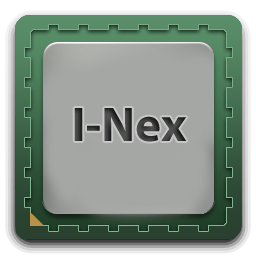

# I-Nex: a system hardware & configuration inventory tool

[](https://i-nex.linux.pl/) [](http://i-nex.linux.pl/screenshots/)

**[Homepage](https://i-nex.linux.pl/)**

I-Nex is an application that gathers information about the hardware components installed in your system the configuration of the software using it, then neatly organizes it using an user interface similar to the popular Windows tool CPU-Z.

I-Nex can display information for the following components: CPU, GPU, Motherboard, Sound, Hard disks, RAM, Network and USB as well as some system info like the hostname, Linux distribution and version, Xorg, GCC, GLX versions and Linux Kernel info.

Besides being able to display hardware information, I-Nex can also generate an advanced report for which you can select what to include and optionally send the report to a service such as Pastebin (and others). It also features an option to take a screenshot of the I-Nex window directly from the application.

The difference between I-Nex and the other hardware information GUI tools available for Linux is that the information is better organized and is displayed faster (than lshw-gtk for instance). Also, the hardware information is presented in a way that’s easier to understand than other such tools.

## Tested on

* Ubuntu
* Linux Mint
* Debian [Bug lp:1258468](https://bugs.launchpad.net/i-nex/+bug/1258468)
* openSUSE [Question:243542](https://answers.launchpad.net/i-nex/+question/243542)
* Fedora/CentOS/RHEL
* Arch Linux
* Manjaro Linux

## Dependencies

* Gambas3
  * gambas3-runtime (>= 3.8.4)
  * gambas3-gb-image (>= 3.8.4)
  * gambas3-gb-qt5 (>= 3.8.4)
  * gambas3-gb-form (>= 3.8.4)
  * gambas3-gb-desktop (>= 3.8.4)
  * gambas3-gb-desktop-x11 (>= 3.8.4)
  * gambas3-gb-form-stock (>= 3.8.4)
* libc6
* pastebinit
* [libcpuid](https://github.com/anrieff/libcpuid)

### Build in Ubuntu

Adding required repositories:

```bash
sudo add-apt-repository -y ppa:gambas-team/gambas3 && \
sudo add-apt-repository -yu ppa:i-nex-development-team/i-nex
```

Install from repository:

```bash
sudo apt install i-nex
```

## Build Debian package from source

Installing dependencies:

```bash
sudo apt install debhelper devscripts git imagemagick lsb-release pkg-config \
libcpuid-dev gambas3-dev gambas3-gb-desktop gambas3-gb-desktop-x11 \
gambas3-gb-form gambas3-gb-image gambas3-gb-qt5
```

Download source code, compile & install:

```bash
git clone https://github.com/i-nex/I-Nex.git && cd I-Nex
debuild -b --no-sign
sudo apt install ../i-nex*.deb
```

## Install RPM package

### Fedora (≳ 30)

```bash
dnf install i-nex
```

### OpenSUSE (≳ 15.1)

```bash
zypper addrepo https://download.opensuse.org/repositories/Education/openSUSE_Tumbleweed/Education.repo
zypper refresh && zypper install i-nex i-nex-data
```

## Build in CentOS/RHEL

### Add required repositories

To satisfy build dependencies, please add the [Fedora EPEL](https://fedoraproject.org/wiki/EPEL) and [NUX Dextop](https://li.nux.ro/repos.html) repositories.

### Installing dependencies

```bash
yum install fdupes glx-utils i2c-tools procps-ng
yum install imagemagick autoconf automake hicolor-icon-theme net-tools \
pkgconfig libcpuid-devel procps-ng-devel freeglut pciutils xz rpm-build \
redhat-rpm-config make gcc
```

### Setup RPM Build Environment

Per CentOS/RHEL instructions [here](https://wiki.centos.org/HowTos/SetupRpmBuildEnvironment)

```bash
mkdir -p ~/rpmbuild/{BUILD,RPMS,SOURCES,SPECS,SRPMS}
echo "%_topdir /home/testuser/rpmbuild" >>~/.rpmmacros
```

### Rebuild Fedora Rawhide RPM dependencies for CentOS/RHEL

where _VERSION_ = currently available Rawhide RPM

`rpmbuild --rebuild gambas3-<VERSION>.src.rpm` [download RPM from Rawhide repository](https://download.fedoraproject.org/pub/fedora/linux/development/rawhide/Everything/source/tree/Packages/)

`rpmbuild --rebuild libcpuid-<VERSION>.src.rpm` [download RPM from Rawhide repository](https://download.fedoraproject.org/pub/fedora/linux/development/rawhide/Everything/source/tree/Packages/)

```bash
cd ~/rpmbuild/RPMS/x86_64/
yum --nogpgcheck localinstall gambas3-runtime gambas3-gb-desktop \
gambas3-gb-form gambas3-gb-form-dialog gambas3-gb-form-stock gambas3-gb-gtk \
gambas3-gb-gui gambas3-gb-image gambas3-gb-qt5* gambas3-gb-settings libcpuid* \
libcpuid*-devel
```

NOTE: Additional packages may need to be (re)built from [Rawhide](https://download.fedoraproject.org/pub/fedora/linux/development/rawhide/Everything/source/tree/Packages/), as Gambas build prerequisites:

```bash
yum --nogpgcheck localinstall allegro* alure* dumb* fluidsynth* lash* \
SDL2_image* SDL2_mixer* SDL2_ttf*
```

### Build RPM from latest commit sources

where _GITTAG_ = Short git commit tag,
_GITLONG_ = Long git commit tag,
_TEMPSRCDIR_ = Temporary folder for uncompressed source

```bash
wget -O ~/rpmbuild/SOURCES/I-Nex-<GITLONG>.zip https://github.com/i-nex/I-Nex/archive/<GITTAG>.zip
unzip ~/rpmbuild/SOURCES/I-Nex-<GITLONG>.zip -d <TEMPSRCDIR>
cp <TEMPSRCDIR>/dists/redhat/i-nex.spec ~/rpmbuild/SPECS
```

> _NOTE:__Edit %define _gittag_, _gitlong_, and _gitdate_ at the top of ~/rpmbuild/SPECS/i-nex.spec

`rpmbuild -bb ~/rpmbuild/SPECS/i-nex.spec`

### Build lastest git snapshot I-Nex release in Arch Linux

```bash
yaourt -S i-nex-git --needed --noconfirm
```

### Install lastest backported I-Nex release in Manjaro Linux

```bash
sudo pacman -S i-nex
```

### Main guide build app from sources

| NOTE: Don't report issues about manual build I-Nex app from sources based on this guide. First of all be sure you have installed all dependencies. Changes specify in pastebinit and inex.mk via sed command are needed for Arch Linux here. In Your distro these values can be different. |

## Downloading sources

```bash
git clone https://github.com/eloaders/I-Nex.git
```

## Build and install app from sources

```bash
cd I-Nex
sed -i 's|python3$|python2|' pastebinit
sed -i -e 's|^STATIC.*|STATIC = false|' i-nex.mk
sed -i -e 's|^UDEV_RULES_DIR.*|UDEV_RULES_DIR = /usr/lib/udev/rules.d|' i-nex.mk
cd I-Nex
autoreconf -i
./configure --prefix=/usr
cd ..
make
sudo make install
```
